Linear Regression
================

## Highlights

===============================================================================================

-   **Algorithms to use:** linear regression (`lm`); robust linear
    regression (`rlm`), and partial least square (`pls`).

-   **Session purpose:** To build a predictive model using linear
    regressions.

===============================================================================================

## 4. Exploring data

## 4.2 Transformations

Most of variables are skewed, the ideal is to transform these data
because the model’s goal is prediction rather than interpretation.

``` r
to.transform     <- preProcess(exploring_data[, numeric_variable], methods = 'BoxCox')
transformed_data <- predict(to.transform, exploring_data[, numeric_variable])

head(transformed_data, 5)
```

    ##        tract      lon       lat       crim         zn      indus        nox
    ## 1 -0.4849072 1.388158 0.5912969 -0.4037797  0.3036114 -1.2803039 -0.1417240
    ## 2 -0.4776246 1.456798 1.1108690 -0.4014508 -0.4793020 -0.5843638 -0.7392460
    ## 3 -0.4768964 1.648991 1.0389282 -0.4014531 -0.4793020 -0.5843638 -0.7392460
    ## 4 -0.4703421 1.758815 1.1987966 -0.4008894 -0.4793020 -1.2993107 -0.8345031
    ## 5 -0.4696139 1.841183 1.2787308 -0.3968198 -0.4793020 -1.2993107 -0.8345031
    ##          rm        age       dis        rad        tax    ptratio         b
    ## 1 0.4335369 -0.1162401 0.1501430 -0.9794426 -0.6713454 -1.4266009 0.4343314
    ## 2 0.2108001  0.3745916 0.5835384 -0.8650900 -0.9919562 -0.2808385 0.4343314
    ## 3 1.3158063 -0.2631314 0.5835384 -0.8650900 -0.9919562 -0.2808385 0.3882205
    ## 4 1.0453401 -0.8112865 1.1246526 -0.7507374 -1.1107009  0.1316360 0.4086135
    ## 5 1.2608452 -0.5103386 1.1246526 -0.7507374 -1.1107009  0.1316360 0.4343314
    ##        lstat
    ## 1 -1.0847502
    ## 2 -0.4872623
    ## 3 -1.2211958
    ## 4 -1.3777491
    ## 5 -1.0344808

### 4.3 Relationships

#### 4.3.1 Correlations

The main assumption for linear regressions is: there is a linear
correlation between the predictor and the outcome, that’s why we need to
know correlation’s values.

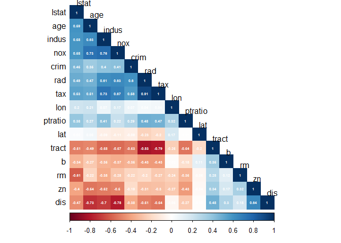<!-- -->

To verify these values, I visualized the data.

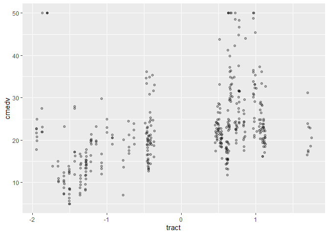<!-- -->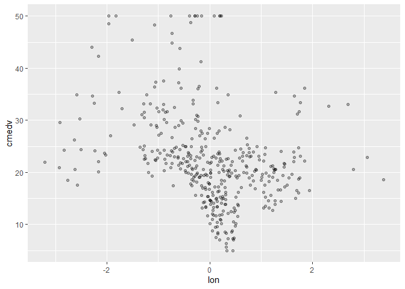<!-- -->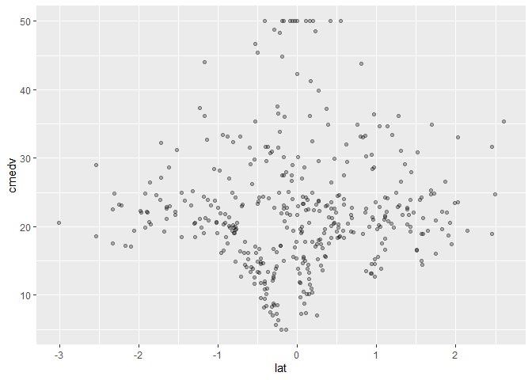<!-- --><!-- -->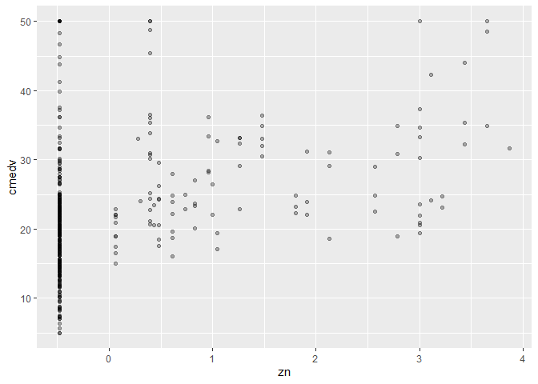<!-- -->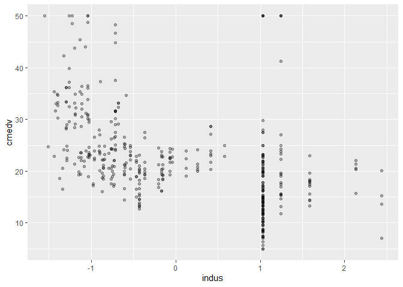<!-- -->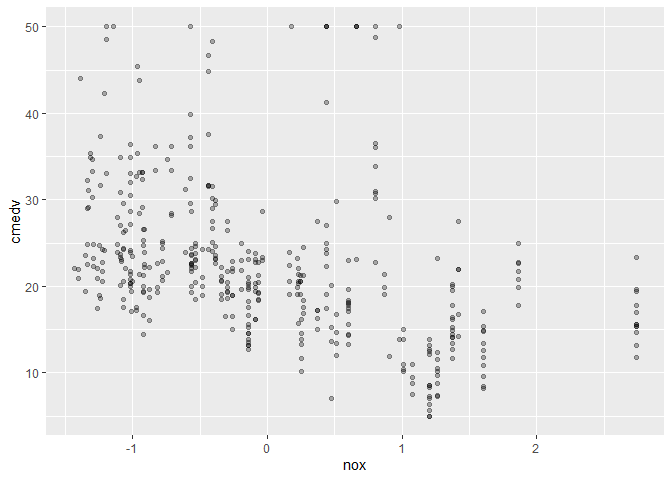<!-- -->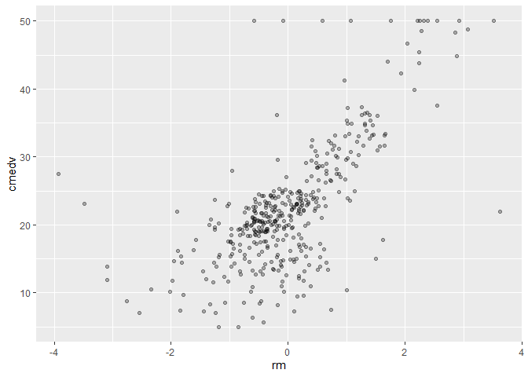<!-- -->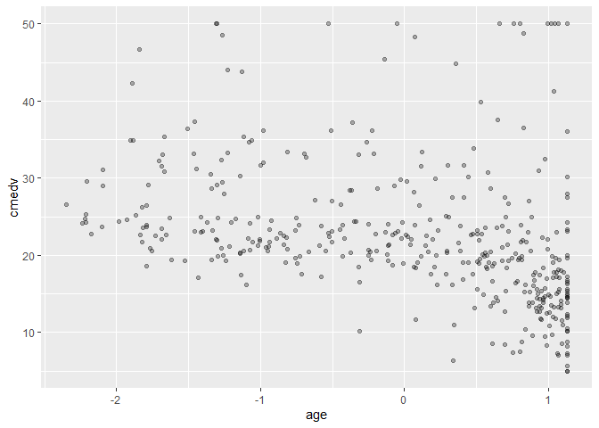<!-- --><!-- --><!-- -->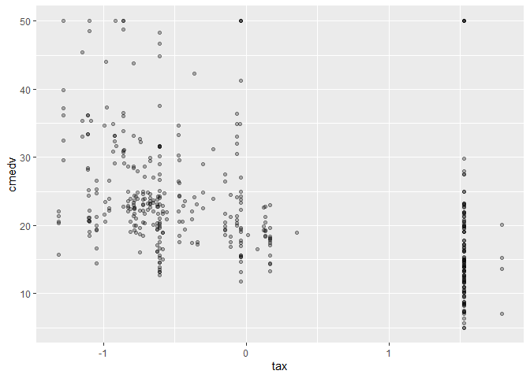<!-- -->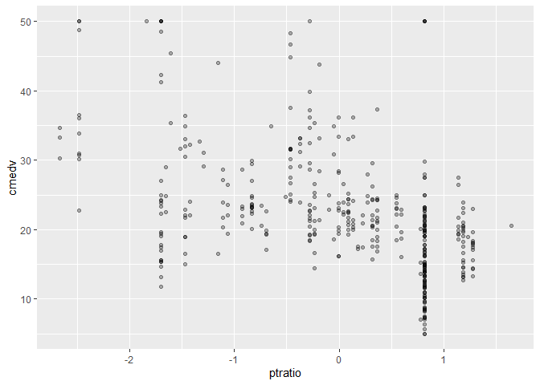<!-- -->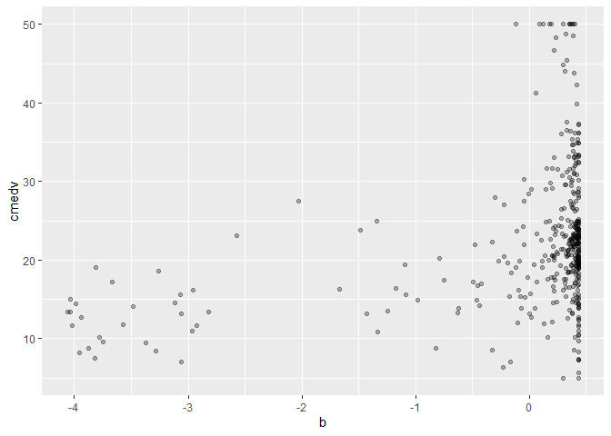<!-- --><!-- -->

Due to their correlations with the outcome, `rm` and `lstat` are the
only ones to keep Additionally, `lstat` shows a curve graph, it would be
a good strategy to implement `lstat^2` into training models.

#### 4.3.2 Factor-outcome

Let’s compare the correlation between `chas` and the outcome.

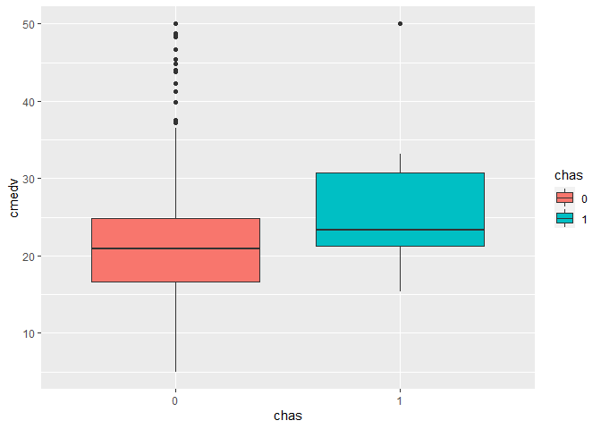<!-- -->

It looks like depending on the level of `chas`, the value of `cmedv`
might change, this predictor will be consider to build the model.

## 5. Training and testing data

The first step to build the model is to split the data with the
predictors to use. We will consider three set of predictors:

1.  `rm`, `lstat`,`cmedv`, and `chas`.
2.  `rm`, `lstat`, `lstat2`,`cmedv`, and `chas`.
3.  `rm`, `lstat`, `lstat2`,and `cmedv`

``` r
columns_to_use     <- c('rm', 'lstat','cmedv', 'chas')
columns_to_exclude <- c('chas')
                    
data_to_use <- raw_data %>%
  select(all_of(columns_to_use)) %>%
  mutate(lstat2 = lstat^2)

# Data with set of predictors 1
data_to_train_1 <- data_to_use[trainingRows, columns_to_use]
data_to_test_1  <- data_to_use[-trainingRows, columns_to_use]
print(colnames(data_to_train_1))
```

    ## [1] "rm"    "lstat" "cmedv" "chas"

``` r
# Data with set of predictors 2
data_to_train_2 <- data_to_use[trainingRows,]
data_to_test_2  <- data_to_use[-trainingRows,]
print(colnames(data_to_train_2))
```

    ## [1] "rm"     "lstat"  "cmedv"  "chas"   "lstat2"

``` r
# Data with set of predictors 3
data_to_train_3 <- data_to_use[trainingRows, ] %>%
  select(-columns_to_exclude)
data_to_test_3  <- data_to_use[-trainingRows,] %>%
  select(-columns_to_exclude)
print(colnames(data_to_train_3))
```

    ## [1] "rm"     "lstat"  "cmedv"  "lstat2"

## 5.1 Building the model

Each dataset will be used for the algorithms: *Linear regression
(`lm`)*, and *Robust Linear regression (`rlm`)*. For *Partial Least
Squares (`pls`)* all numeric (except `medv`), and `chas` variable will
be used, this is due to its working process.

``` r
# Resampling strategy
ctrl <- trainControl(method = "cv", number = 10)

# lm models
lm.model_1  <- train(cmedv ~ ., data = data_to_train_1, preProcess = c('BoxCox','scale', 'center'),
                     method = 'lm', trControl = ctrl)

lm.model1_training <- predict(lm.model_1, data_to_train_1)
lm.model1_testing  <- predict(lm.model_1, data_to_test_1)

lm.model_2  <- train(cmedv ~ ., data = data_to_train_2, preProcess = c('BoxCox','scale', 'center', 'pca'),
                     method = 'lm', trControl = ctrl)

lm.model2_training <- predict(lm.model_2, data_to_train_2)
lm.model2_testing  <- predict(lm.model_2, data_to_test_2)

lm.model_3  <- train(cmedv ~ ., data = data_to_train_3, preProcess = c('BoxCox','scale', 'center', 'pca'),
                     method = 'lm', trControl = ctrl)

lm.model3_training <- predict(lm.model_3, data_to_train_3)
lm.model3_testing  <- predict(lm.model_3, data_to_test_3)

# rlm models
rlm.model_1  <- train(cmedv ~ ., data = data_to_train_1, preProcess = c('BoxCox','scale', 'center'),
                      method = 'lm', trControl = ctrl)

rlm.model1_training <- predict(rlm.model_1, data_to_train_1)
rlm.model1_testing  <- predict(rlm.model_1, data_to_test_1)

rlm.model_2  <- train(cmedv ~ ., data = data_to_train_2, preProcess = c('BoxCox','scale', 'center', 'pca'),
                      method = 'lm', trControl = ctrl)

rlm.model2_training <- predict(rlm.model_2, data_to_train_2)
rlm.model2_testing  <- predict(rlm.model_2, data_to_test_2)

rlm.model_3  <- train(cmedv ~ ., data = data_to_train_3, preProcess = c('BoxCox','scale', 'center', 'pca'),
                      method = 'lm', trControl = ctrl)

rlm.model3_training <- predict(rlm.model_3, data_to_train_3)
rlm.model3_testing  <- predict(rlm.model_3, data_to_test_3)

# pls models
pls.model_1  <- train(cmedv ~ ., data = raw_data[trainingRows, c(numeric_variable, 'chas', 'cmedv')], preProcess = c('BoxCox','scale', 'center', 'pca'),
                      method = 'pls', trControl = ctrl)

pls.model1_training <- predict(rlm.model_1, raw_data[trainingRows, c(numeric_variable, 'chas')])
pls.model1_testing  <- predict(rlm.model_1, raw_data[-trainingRows, c(numeric_variable, 'chas')])
```

## 5.2 Verifying assumptions

## 5.3 Comparing performance

### 5.3.1 Observed vs Predicted

``` r
# lm model
plot(data_to_test_1$cmedv, lm.model1_testing, col = 'blue')
```

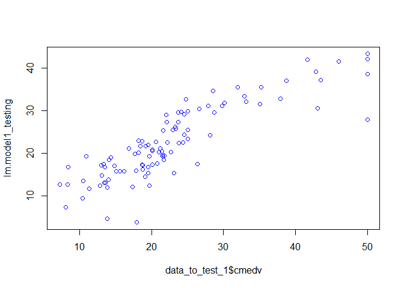<!-- -->

``` r
plot(data_to_test_2$cmedv, lm.model2_testing, col = 'blue')
```

<!-- -->

``` r
plot(data_to_test_3$cmedv, lm.model3_testing, col = 'blue')
```

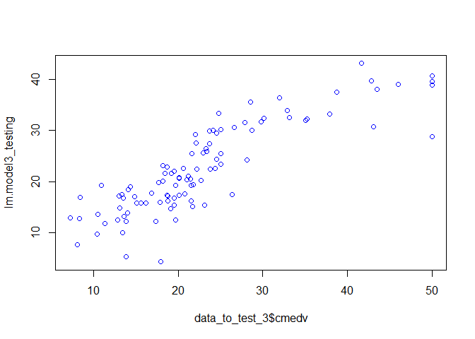<!-- -->

``` r
# rlm models
plot(data_to_test_1$cmedv, rlm.model1_testing, col = 'blue')
```

<!-- -->

``` r
plot(data_to_test_2$cmedv, rlm.model2_testing, col = 'blue')
```

<!-- -->

``` r
plot(data_to_test_3$cmedv, rlm.model3_testing, col = 'blue')
```

<!-- -->

``` r
# pls model
plot(raw_data[-trainingRows, ]$cmedv, pls.model1_testing, col = 'blue')
```

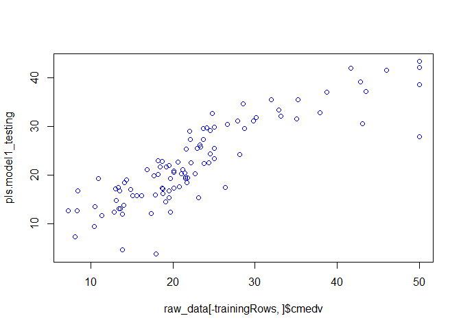<!-- -->

Visually, all the models show the same correlation between the predicted
and observed values.

### 5.3.2 Model’s comparison

``` r
res <- resamples(list(lm1 = lm.model_1, lm2 = lm.model_1, lm3 = lm.model_1, 
                      rlm1 = rlm.model_1, rlm2 = lm.model_1, rlm3 = rlm.model_1, 
                      pls = pls.model_1))

summary(res)
```

    ## 
    ## Call:
    ## summary.resamples(object = res)
    ## 
    ## Models: lm1, lm2, lm3, rlm1, rlm2, rlm3, pls 
    ## Number of resamples: 10 
    ## 
    ## MAE 
    ##          Min.  1st Qu.   Median     Mean  3rd Qu.     Max. NA's
    ## lm1  3.278108 3.409027 3.607370 3.667914 3.883419 4.390436    0
    ## lm2  3.278108 3.409027 3.607370 3.667914 3.883419 4.390436    0
    ## lm3  3.278108 3.409027 3.607370 3.667914 3.883419 4.390436    0
    ## rlm1 2.930936 3.444786 3.599994 3.658270 3.735425 4.410050    0
    ## rlm2 3.278108 3.409027 3.607370 3.667914 3.883419 4.390436    0
    ## rlm3 2.930936 3.444786 3.599994 3.658270 3.735425 4.410050    0
    ## pls  2.590998 2.855507 3.206848 3.180457 3.419667 4.016251    0
    ## 
    ## RMSE 
    ##          Min.  1st Qu.   Median     Mean  3rd Qu.     Max. NA's
    ## lm1  4.040190 4.436789 4.679741 4.963690 5.407191 6.352932    0
    ## lm2  4.040190 4.436789 4.679741 4.963690 5.407191 6.352932    0
    ## lm3  4.040190 4.436789 4.679741 4.963690 5.407191 6.352932    0
    ## rlm1 3.486282 4.625610 4.766570 4.947248 5.317784 6.126179    0
    ## rlm2 4.040190 4.436789 4.679741 4.963690 5.407191 6.352932    0
    ## rlm3 3.486282 4.625610 4.766570 4.947248 5.317784 6.126179    0
    ## pls  3.411452 4.108646 4.402862 4.579830 4.838525 6.535106    0
    ## 
    ## Rsquared 
    ##           Min.   1st Qu.    Median      Mean   3rd Qu.      Max. NA's
    ## lm1  0.5153549 0.6446373 0.7413454 0.6984227 0.7708681 0.8293032    0
    ## lm2  0.5153549 0.6446373 0.7413454 0.6984227 0.7708681 0.8293032    0
    ## lm3  0.5153549 0.6446373 0.7413454 0.6984227 0.7708681 0.8293032    0
    ## rlm1 0.5613951 0.6810414 0.7266226 0.6994120 0.7420111 0.7689346    0
    ## rlm2 0.5153549 0.6446373 0.7413454 0.6984227 0.7708681 0.8293032    0
    ## rlm3 0.5613951 0.6810414 0.7266226 0.6994120 0.7420111 0.7689346    0
    ## pls  0.5343062 0.7202712 0.7693063 0.7473199 0.8131503 0.8327608    0

``` r
modelDifferences <- diff(res)
summary(modelDifferences)
```

    ## 
    ## Call:
    ## summary.diff.resamples(object = modelDifferences)
    ## 
    ## p-value adjustment: bonferroni 
    ## Upper diagonal: estimates of the difference
    ## Lower diagonal: p-value for H0: difference = 0
    ## 
    ## MAE 
    ##      lm1    lm2       lm3       rlm1      rlm2      rlm3      pls      
    ## lm1          0.000000  0.000000  0.009645  0.000000  0.009645  0.487457
    ## lm2  NA                0.000000  0.009645  0.000000  0.009645  0.487457
    ## lm3  NA     NA                   0.009645  0.000000  0.009645  0.487457
    ## rlm1 1.0000 1.0000    1.0000              -0.009645  0.000000  0.477813
    ## rlm2 NA     NA        NA        1.0000               0.009645  0.487457
    ## rlm3 1.0000 1.0000    1.0000    NA        1.0000               0.477813
    ## pls  0.3293 0.3293    0.3293    0.5033    0.3293    0.5033             
    ## 
    ## RMSE 
    ##      lm1 lm2      lm3      rlm1     rlm2     rlm3     pls     
    ## lm1       0.00000  0.00000  0.01644  0.00000  0.01644  0.38386
    ## lm2  NA            0.00000  0.01644  0.00000  0.01644  0.38386
    ## lm3  NA  NA                 0.01644  0.00000  0.01644  0.38386
    ## rlm1 1   1        1                 -0.01644  0.00000  0.36742
    ## rlm2 NA  NA       NA       1                  0.01644  0.38386
    ## rlm3 1   1        1        NA       1                  0.36742
    ## pls  1   1        1        1        1        1                
    ## 
    ## Rsquared 
    ##      lm1 lm2        lm3        rlm1       rlm2       rlm3       pls       
    ## lm1       0.0000000  0.0000000 -0.0009893  0.0000000 -0.0009893 -0.0488971
    ## lm2  NA              0.0000000 -0.0009893  0.0000000 -0.0009893 -0.0488971
    ## lm3  NA  NA                    -0.0009893  0.0000000 -0.0009893 -0.0488971
    ## rlm1 1   1          1                      0.0009893  0.0000000 -0.0479078
    ## rlm2 NA  NA         NA         1                     -0.0009893 -0.0488971
    ## rlm3 1   1          1          NA         1                     -0.0479078
    ## pls  1   1          1          1          1          1

`pls.model_1` got the best performance having the lowest values for
`RMSE` and `MAE`, even though, the differences are too small and non
statistical significant among all the models, which might mean the
selection of the variable was well done for the non pls models. So,
following the *parsimonious* principle, we might choose `lm.model_1` or
`lm.model_3`. In this case, we will take model `lm.model_1`.

## 6. Saving the model

``` r
saveRDS(lm.model_1, file = ".\\lm_model.rda")
```
