Owner-occupied homes prediction using linear regression
================

## Highlights

===============================================================================================

-   **Algorithms to use:** linear regression (`lm`); robust linear
    regression (`rlm`), and partial least square (`pls`).

-   **Session purpose:** To build a predictive model using linear
    regressions.

===============================================================================================

## 1. Model’s Purpose

To predict ***corrected median value of owner-occupied Boston’s homes in
USD 1000’s*** (`cmedv`). The model might not be generalizable to some
towns due to the lack of data from some of them. Review session 4.1.1.

## 2. Data

The dataset to use is `BostonHousing2` from `mlbench` library. The
outcome is labelled as `cmedv`. There are not missing values.

    ##                 town         tract           lon              lat       
    ##  Cambridge        : 30   Min.   :   1   Min.   :-71.29   Min.   :42.03  
    ##  Boston Savin Hill: 23   1st Qu.:1303   1st Qu.:-71.09   1st Qu.:42.18  
    ##  Lynn             : 22   Median :3394   Median :-71.05   Median :42.22  
    ##  Boston Roxbury   : 19   Mean   :2700   Mean   :-71.06   Mean   :42.22  
    ##  Newton           : 18   3rd Qu.:3740   3rd Qu.:-71.02   3rd Qu.:42.25  
    ##  Somerville       : 15   Max.   :5082   Max.   :-70.81   Max.   :42.38  
    ##  (Other)          :379                                                  
    ##       medv           cmedv            crim                zn        
    ##  Min.   : 5.00   Min.   : 5.00   Min.   : 0.00632   Min.   :  0.00  
    ##  1st Qu.:17.02   1st Qu.:17.02   1st Qu.: 0.08205   1st Qu.:  0.00  
    ##  Median :21.20   Median :21.20   Median : 0.25651   Median :  0.00  
    ##  Mean   :22.53   Mean   :22.53   Mean   : 3.61352   Mean   : 11.36  
    ##  3rd Qu.:25.00   3rd Qu.:25.00   3rd Qu.: 3.67708   3rd Qu.: 12.50  
    ##  Max.   :50.00   Max.   :50.00   Max.   :88.97620   Max.   :100.00  
    ##                                                                     
    ##      indus       chas         nox               rm             age        
    ##  Min.   : 0.46   0:471   Min.   :0.3850   Min.   :3.561   Min.   :  2.90  
    ##  1st Qu.: 5.19   1: 35   1st Qu.:0.4490   1st Qu.:5.886   1st Qu.: 45.02  
    ##  Median : 9.69           Median :0.5380   Median :6.208   Median : 77.50  
    ##  Mean   :11.14           Mean   :0.5547   Mean   :6.285   Mean   : 68.57  
    ##  3rd Qu.:18.10           3rd Qu.:0.6240   3rd Qu.:6.623   3rd Qu.: 94.08  
    ##  Max.   :27.74           Max.   :0.8710   Max.   :8.780   Max.   :100.00  
    ##                                                                           
    ##       dis              rad              tax           ptratio     
    ##  Min.   : 1.130   Min.   : 1.000   Min.   :187.0   Min.   :12.60  
    ##  1st Qu.: 2.100   1st Qu.: 4.000   1st Qu.:279.0   1st Qu.:17.40  
    ##  Median : 3.207   Median : 5.000   Median :330.0   Median :19.05  
    ##  Mean   : 3.795   Mean   : 9.549   Mean   :408.2   Mean   :18.46  
    ##  3rd Qu.: 5.188   3rd Qu.:24.000   3rd Qu.:666.0   3rd Qu.:20.20  
    ##  Max.   :12.127   Max.   :24.000   Max.   :711.0   Max.   :22.00  
    ##                                                                   
    ##        b              lstat      
    ##  Min.   :  0.32   Min.   : 1.73  
    ##  1st Qu.:375.38   1st Qu.: 6.95  
    ##  Median :391.44   Median :11.36  
    ##  Mean   :356.67   Mean   :12.65  
    ##  3rd Qu.:396.23   3rd Qu.:16.95  
    ##  Max.   :396.90   Max.   :37.97  
    ## 

## 3. Splitting data

The resampling method will be ***stratified cross-validation***. Even
though training data will have the same rows as the `exploring_data`, I
decided to name them differently because training data will have less
predictors (selected predictors).

``` r
library(caret)
raw_data     <- BostonHousing2
outcome      <- raw_data$cmedv

set.seed(2156)
trainingRows <- createDataPartition(outcome,
                                    p = .8,
                                    list= FALSE)

# Data to explore
exploring_data <- raw_data[trainingRows, ]
```

## 4. Exploring data

Variables’ names were divided into different vectors depending on their
variable type. `numeric_variable` for numeric data and `factor_variable`
for factors. `medv` was excluded because it could lead to a loss of
performance due to its relationship with `cmedv` (both are almost the
same variables).

``` r
print(numeric_variable)
```

    ##  [1] "tract"   "lon"     "lat"     "cmedv"   "crim"    "zn"      "indus"  
    ##  [8] "nox"     "rm"      "age"     "dis"     "rad"     "tax"     "ptratio"
    ## [15] "b"       "lstat"

``` r
print(factor_variable)
```

    ## [1] "town" "chas"

### 4.1 Distributions

#### 4.1.1 Factors

1.  `town` has 92 levels with few observations in most of them. To
    include it, we would require almost 92 dummy variables or to know
    deeply their patterns to split them into other classification,
    that’s why it will be dropped.

<!-- -->

    ## 
    ##               Cambridge       Boston Savin Hill                    Lynn 
    ##                      23                      19                      18 
    ##                  Newton     Boston South Boston          Boston Roxbury 
    ##                      15                      13                      12 
    ##              Somerville      Boston East Boston               Brookline 
    ##                      12                      10                      10 
    ##       Boston Dorchester                 Peabody               Braintree 
    ##                       9                       9                       8 
    ##                 Medford                  Quincy                 Waltham 
    ##                       8                       8                       8 
    ##               Arlington Boston Allston-Brighton         Boston Downtown 
    ##                       7                       7                       7 
    ##              Framingham                  Malden                   Salem 
    ##                       7                       7                       7 
    ##                 Belmont     Boston Forest Hills                Weymouth 
    ##                       6                       6                       6 
    ##         Boston Back Bay                 Everett               Lexington 
    ##                       5                       5                       5 
    ##                 Norwood                  Revere                  Woburn 
    ##                       5                       5                       5 
    ##                 Beverly      Boston Charlestown        Boston Hyde Park 
    ##                       4                       4                       4 
    ##         Boston Mattapan                 Chelsea                  Dedham 
    ##                       4                       4                       4 
    ##                 Melrose                  Milton                  Natick 
    ##                       4                       4                       4 
    ##                 Needham                  Sargus               Wakefield 
    ##                       4                       4                       4 
    ##              Winchester                Winthrop      Boston Beacon Hill 
    ##                       4                       4                       3 
    ##     Boston West Roxbury              Burlington                 Concord 
    ##                       3                       3                       3 
    ##                Randolph                 Reading                  Sharon 
    ##                       3                       3                       3 
    ##                 Walpole               Watertown              Wilmington 
    ##                       3                       3                       3 
    ##                 Ashland                 Bedford                  Canton 
    ##                       2                       2                       2 
    ##                 Danvers                 Hingham                Holbrook 
    ##                       2                       2                       2 
    ##               Lynnfield              Marblehead           North Reading 
    ##                       2                       2                       2 
    ##                Rockland                Stoneham              Swampscott 
    ##                       2                       2                       2 
    ##                 Wayland               Wellesley                  Weston 
    ##                       2                       2                       2 
    ##        Boston North End                Cohasset                Hamilton 
    ##                       1                       1                       1 
    ##                 Hanover                    Hull                 Lincoln 
    ##                       1                       1                       1 
    ##              Manchester              Marshfield                Medfield 
    ##                       1                       1                       1 
    ##               Middleton                  Millis                  Nahant 
    ##                       1                       1                       1 
    ##                Pembroke                Scituate                Sherborn 
    ##                       1                       1                       1 
    ##                 Sudbury               Topsfield                  Wenham 
    ##                       1                       1                       1 
    ##                Westwood                   Dover                 Duxbury 
    ##                       1                       0                       0 
    ##                 Norfolk                 Norwell 
    ##                       0                       0

2.  `chas` has few observations in level 1, however, it will be kept
    because its ratio with level 0 is lower than 20.
    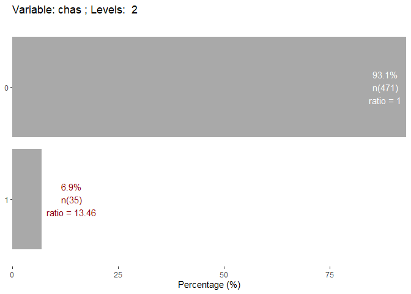<!-- -->

#### 4.1.2 Numeric variables

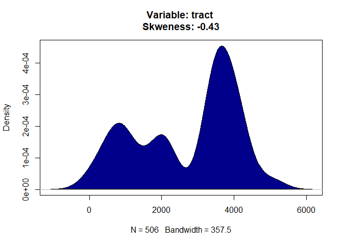<!-- -->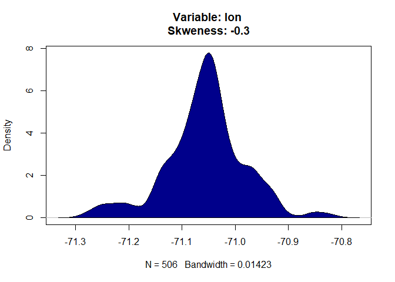<!-- -->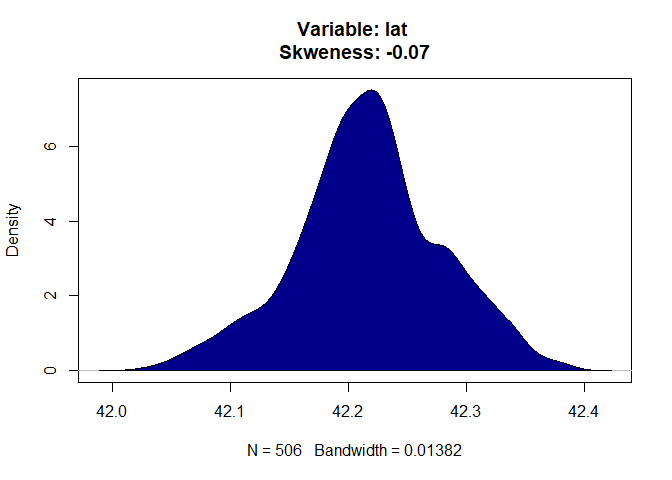<!-- -->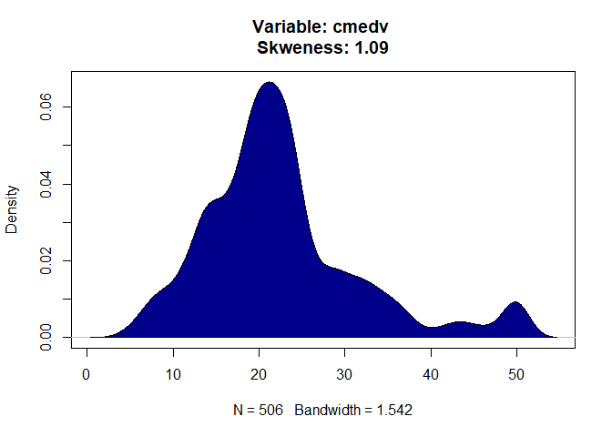<!-- -->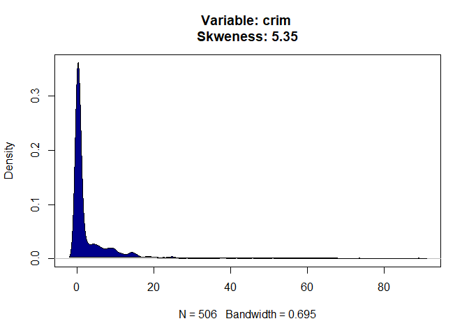<!-- -->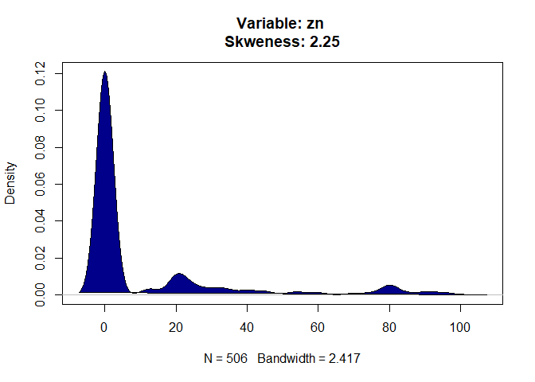<!-- -->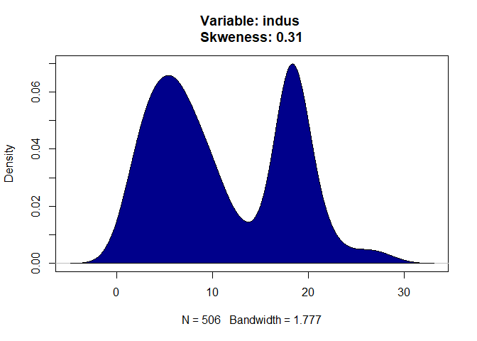<!-- -->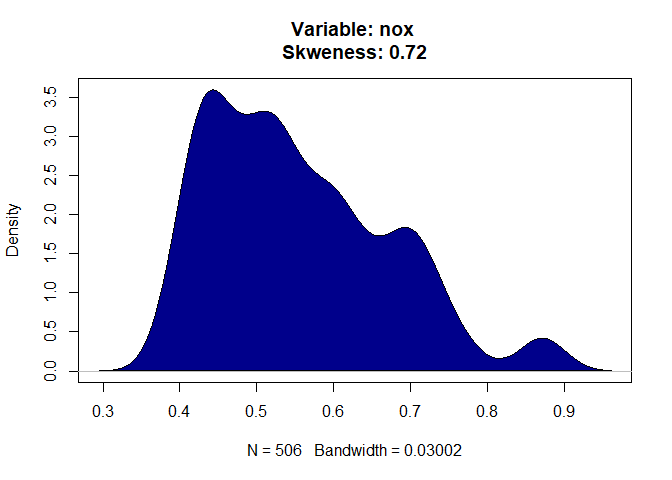<!-- -->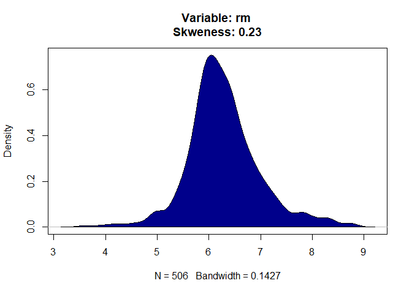<!-- -->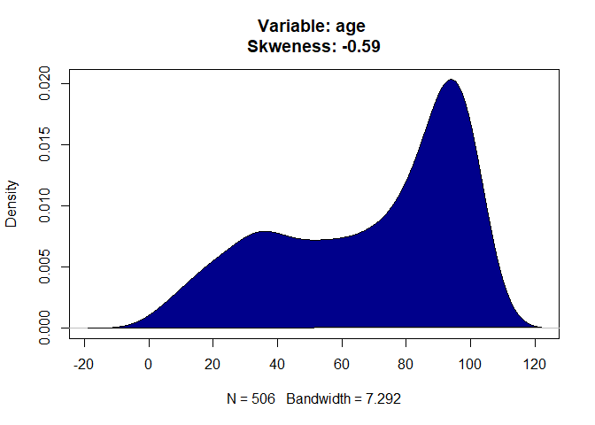<!-- -->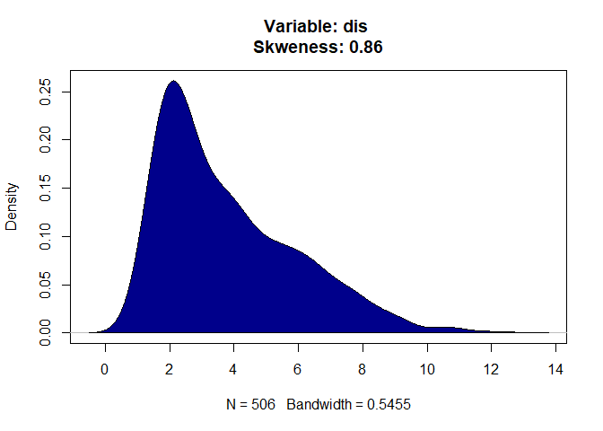<!-- -->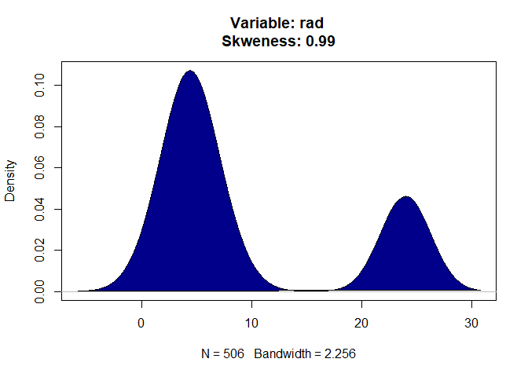<!-- -->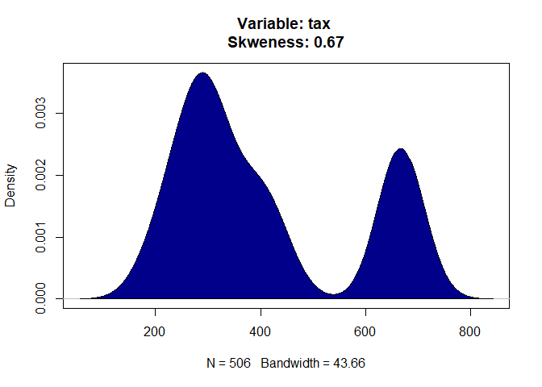<!-- -->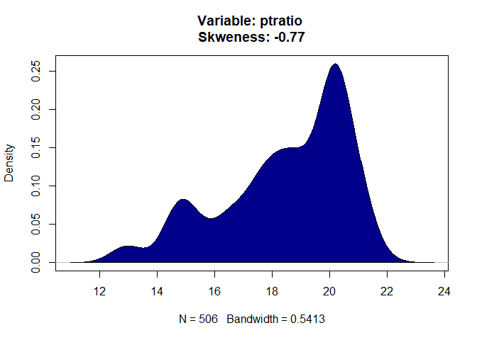<!-- -->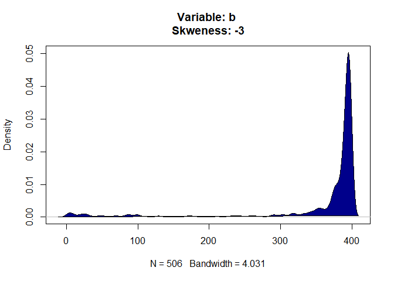<!-- -->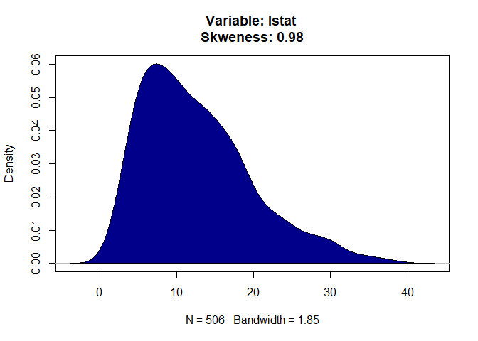<!-- -->

## 4.2 Transformations

Most of variables are skewed, the ideal is to transform these data
because the model’s goal is prediction rather than interpretation.

``` r
to.transform     <- preProcess(exploring_data[, numeric_variable], methods = 'BoxCox')
transformed_data <- predict(to.transform, exploring_data[, numeric_variable])

head(transformed_data, 5)
```

    ##        tract      lon       lat       cmedv       crim         zn      indus
    ## 1 -0.4849072 1.388158 0.5912969  0.17251022 -0.4037797  0.3036114 -1.2803039
    ## 2 -0.4776246 1.456798 1.1108690 -0.09365308 -0.4014508 -0.4793020 -0.5843638
    ## 3 -0.4768964 1.648991 1.0389282  1.35915494 -0.4014531 -0.4793020 -0.5843638
    ## 4 -0.4703421 1.758815 1.1987966  1.21498315 -0.4008894 -0.4793020 -1.2993107
    ## 5 -0.4696139 1.841183 1.2787308  1.52550700 -0.3968198 -0.4793020 -1.2993107
    ##          nox        rm        age       dis        rad        tax    ptratio
    ## 1 -0.1417240 0.4335369 -0.1162401 0.1501430 -0.9794426 -0.6713454 -1.4266009
    ## 2 -0.7392460 0.2108001  0.3745916 0.5835384 -0.8650900 -0.9919562 -0.2808385
    ## 3 -0.7392460 1.3158063 -0.2631314 0.5835384 -0.8650900 -0.9919562 -0.2808385
    ## 4 -0.8345031 1.0453401 -0.8112865 1.1246526 -0.7507374 -1.1107009  0.1316360
    ## 5 -0.8345031 1.2608452 -0.5103386 1.1246526 -0.7507374 -1.1107009  0.1316360
    ##           b      lstat
    ## 1 0.4343314 -1.0847502
    ## 2 0.4343314 -0.4872623
    ## 3 0.3882205 -1.2211958
    ## 4 0.4086135 -1.3777491
    ## 5 0.4343314 -1.0344808

### 4.3 Relationships

#### 4.3.1 Correlations

The main assumption for linear regressions is: there is a linear
correlation between the predictor and the outcome, that’s why we need to
know correlation’s values.

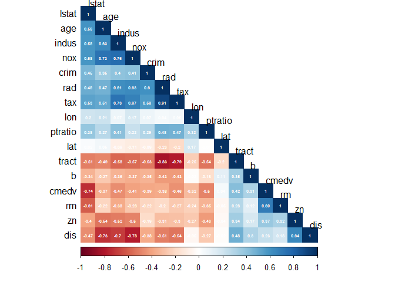<!-- -->

To verify these values, I visualized the data.

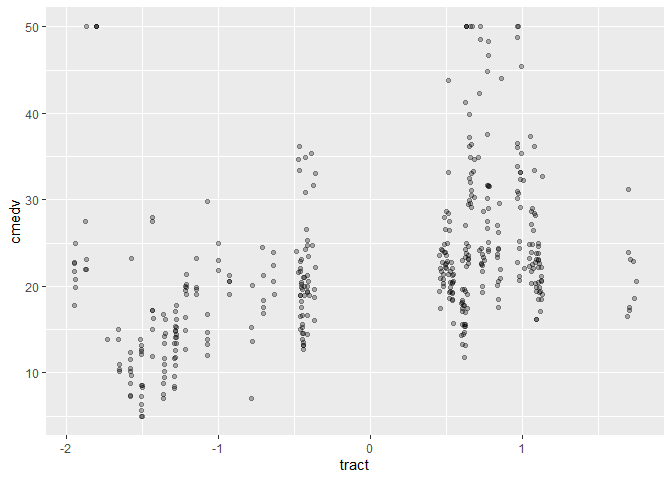<!-- -->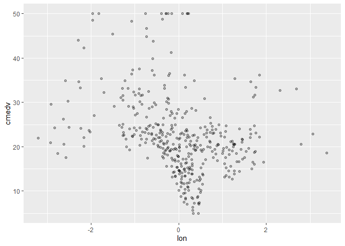<!-- --><!-- -->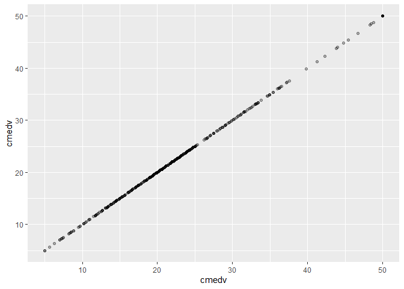<!-- -->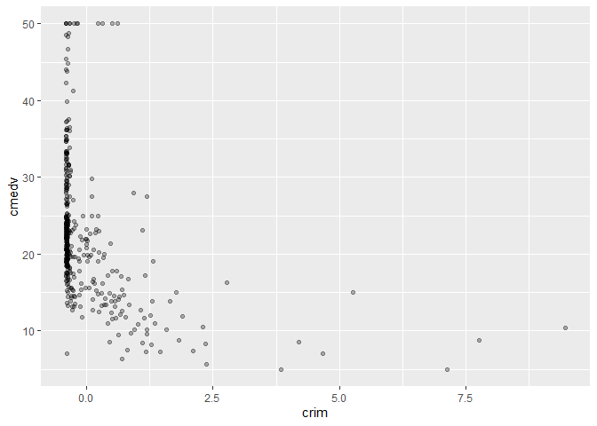<!-- -->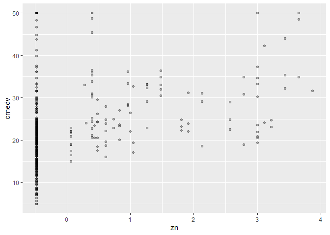<!-- --><!-- --><!-- -->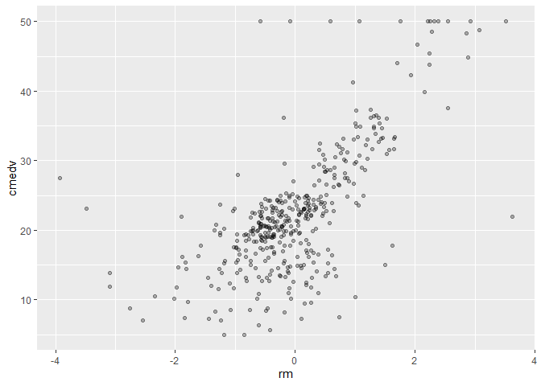<!-- --><!-- -->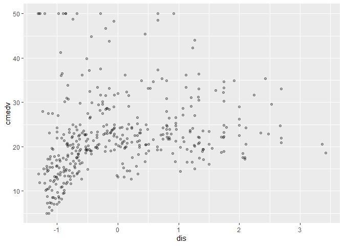<!-- -->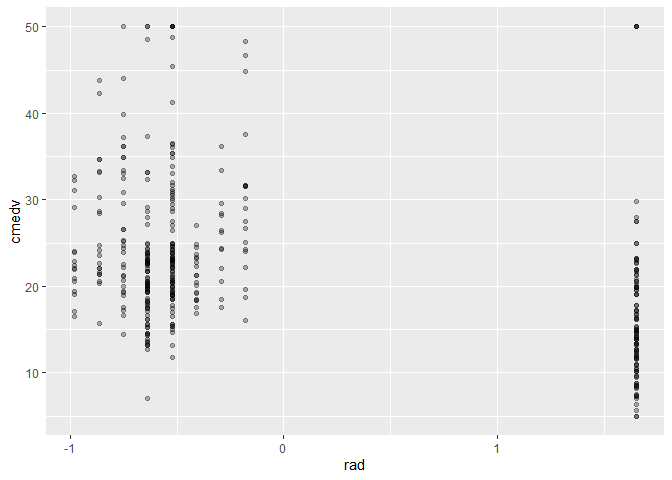<!-- --><!-- -->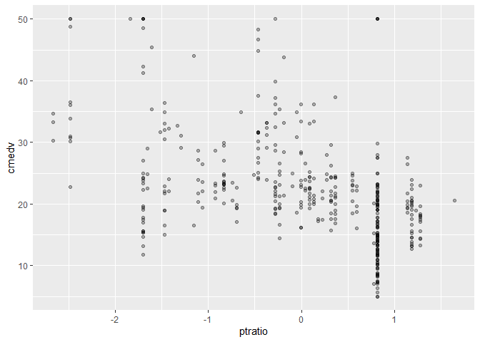<!-- --><!-- -->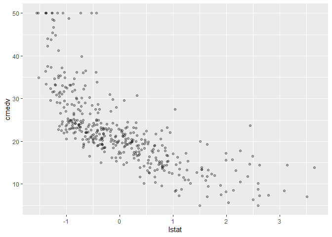<!-- -->

Due to their correlations with the outcome, `rm` and `lstat` are the
only ones to keep Additionally, `lstat` shows a curve graph, it would be
a good strategy to implement `lstat^2` into training models.

#### 4.3.2 Factor-outcome

Let’s compare the correlation between `chas` and the outcome.

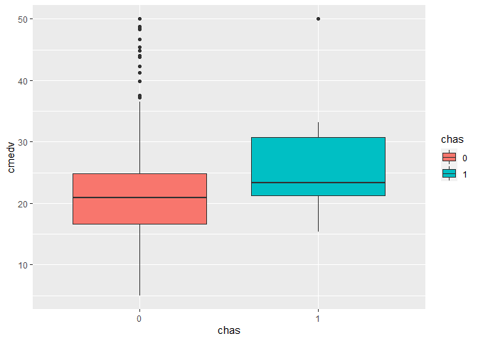<!-- -->

It looks like depending on the level of `chas`, the value of `cmedv`
might change, this predictor will be consider to build the model.

## 5. Training and testing data

The first step to build the model is to split the data with the
predictors to use. We will consider three set of predictors:

1.  `rm`, `lstat`,`cmedv`, and `chas`.
2.  `rm`, `lstat`, `lstat2`,`cmedv`, and `chas`.
3.  `rm`, `lstat`, `lstat2`,and `cmedv`

``` r
columns_to_use     <- c('rm', 'lstat','cmedv', 'chas')
columns_to_exclude <- c('chas')
                    
data_to_use <- raw_data %>%
  select(all_of(columns_to_use)) %>%
  mutate(lstat2 = lstat^2)

# Data with set of predictors 1
data_to_train_1 <- data_to_use[trainingRows, columns_to_use]
data_to_test_1  <- data_to_use[-trainingRows, columns_to_use]
print(colnames(data_to_train_1))
```

    ## [1] "rm"    "lstat" "cmedv" "chas"

``` r
# Data with set of predictors 2
data_to_train_2 <- data_to_use[trainingRows,]
data_to_test_2  <- data_to_use[-trainingRows,]
print(colnames(data_to_train_2))
```

    ## [1] "rm"     "lstat"  "cmedv"  "chas"   "lstat2"

``` r
# Data with set of predictors 3
data_to_train_3 <- data_to_use[trainingRows, ] %>%
  select(-columns_to_exclude)
data_to_test_3  <- data_to_use[-trainingRows,] %>%
  select(-columns_to_exclude)
print(colnames(data_to_train_3))
```

    ## [1] "rm"     "lstat"  "cmedv"  "lstat2"

## 5.1 Building the model

Each dataset will be used for the algorithms: *Linear reagression
(`lm`)*, and *Robust Linear regression (`rlm`)*. For *Partial Least
Squares (`pls`)* all numeric (except `medv`), and `chas` variable will
be used, this is due to its working process.

``` r
# Resampling strategy
ctrl <- trainControl(method = "cv", number = 10)

# lm models
lm.model_1  <- train(cmedv ~ ., data = data_to_train_1, preProcess = c('BoxCox','scale', 'center'),
                     method = 'lm', trControl = ctrl)

lm.model1_training <- predict(lm.model_1, data_to_train_1)
lm.model1_testing  <- predict(lm.model_1, data_to_test_1)

lm.model_2  <- train(cmedv ~ ., data = data_to_train_2, preProcess = c('BoxCox','scale', 'center', 'pca'),
                     method = 'lm', trControl = ctrl)

lm.model2_training <- predict(lm.model_2, data_to_train_2)
lm.model2_testing  <- predict(lm.model_2, data_to_test_2)

lm.model_3  <- train(cmedv ~ ., data = data_to_train_3, preProcess = c('BoxCox','scale', 'center', 'pca'),
                     method = 'lm', trControl = ctrl)

lm.model3_training <- predict(lm.model_3, data_to_train_3)
lm.model3_testing  <- predict(lm.model_3, data_to_test_3)

# rlm models
rlm.model_1  <- train(cmedv ~ ., data = data_to_train_1, preProcess = c('BoxCox','scale', 'center'),
                      method = 'lm', trControl = ctrl)

rlm.model1_training <- predict(rlm.model_1, data_to_train_1)
rlm.model1_testing  <- predict(rlm.model_1, data_to_test_1)

rlm.model_2  <- train(cmedv ~ ., data = data_to_train_2, preProcess = c('BoxCox','scale', 'center', 'pca'),
                      method = 'lm', trControl = ctrl)

rlm.model2_training <- predict(rlm.model_2, data_to_train_2)
rlm.model2_testing  <- predict(rlm.model_2, data_to_test_2)

rlm.model_3  <- train(cmedv ~ ., data = data_to_train_3, preProcess = c('BoxCox','scale', 'center', 'pca'),
                      method = 'lm', trControl = ctrl)

rlm.model3_training <- predict(rlm.model_3, data_to_train_3)
rlm.model3_testing  <- predict(rlm.model_3, data_to_test_3)

# pls models
pls.model_1  <- train(cmedv ~ ., data = raw_data[trainingRows, c(numeric_variable, 'chas')], preProcess = c('BoxCox','scale', 'center', 'pca'),
                      method = 'pls', trControl = ctrl)

pls.model1_training <- predict(rlm.model_1, raw_data[trainingRows, c(numeric_variable, 'chas')])
pls.model1_testing  <- predict(rlm.model_1, raw_data[-trainingRows, c(numeric_variable, 'chas')])
```

## 5.2 Verifying assumptions

## 5.3 Comparing performance

### 5.3.1 Observed vs Predicted

``` r
# lm model
plot(data_to_test_1$cmedv, lm.model1_testing, col = 'blue')
```

<!-- -->

``` r
plot(data_to_test_2$cmedv, lm.model2_testing, col = 'blue')
```

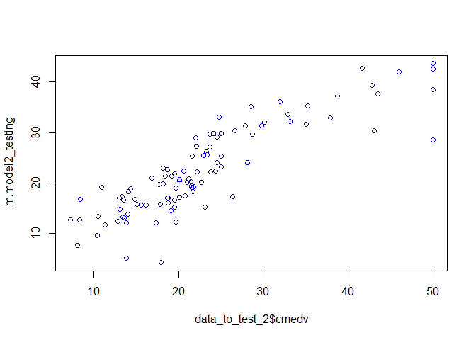<!-- -->

``` r
plot(data_to_test_3$cmedv, lm.model3_testing, col = 'blue')
```

<!-- -->

``` r
# rlm models
plot(data_to_test_1$cmedv, rlm.model1_testing, col = 'blue')
```

<!-- -->

``` r
plot(data_to_test_2$cmedv, rlm.model2_testing, col = 'blue')
```

<!-- -->

``` r
plot(data_to_test_3$cmedv, rlm.model3_testing, col = 'blue')
```

<!-- -->

``` r
# pls model
plot(raw_data[-trainingRows, ]$cmedv, pls.model1_testing, col = 'blue')
```

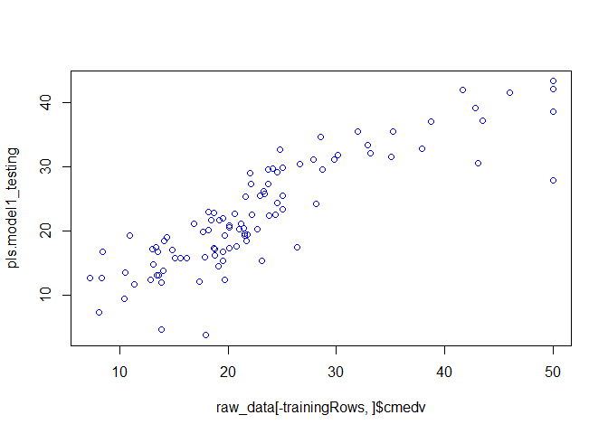<!-- -->

Visually, all the models show the same correlation between the predicted
and observed values.

### 5.3.2 Model’s comparison

``` r
res <- resamples(list(lm1 = lm.model_1, lm2 = lm.model_1, lm3 = lm.model_1, 
                      rlm1 = rlm.model_1, rlm2 = lm.model_1, rlm3 = rlm.model_1, 
                      pls = pls.model_1))

summary(res)
```

    ## 
    ## Call:
    ## summary.resamples(object = res)
    ## 
    ## Models: lm1, lm2, lm3, rlm1, rlm2, rlm3, pls 
    ## Number of resamples: 10 
    ## 
    ## MAE 
    ##          Min.  1st Qu.   Median     Mean  3rd Qu.     Max. NA's
    ## lm1  3.278108 3.409027 3.607370 3.667914 3.883419 4.390436    0
    ## lm2  3.278108 3.409027 3.607370 3.667914 3.883419 4.390436    0
    ## lm3  3.278108 3.409027 3.607370 3.667914 3.883419 4.390436    0
    ## rlm1 2.930936 3.444786 3.599994 3.658270 3.735425 4.410050    0
    ## rlm2 3.278108 3.409027 3.607370 3.667914 3.883419 4.390436    0
    ## rlm3 2.930936 3.444786 3.599994 3.658270 3.735425 4.410050    0
    ## pls  2.590998 2.855507 3.206848 3.180457 3.419667 4.016251    0
    ## 
    ## RMSE 
    ##          Min.  1st Qu.   Median     Mean  3rd Qu.     Max. NA's
    ## lm1  4.040190 4.436789 4.679741 4.963690 5.407191 6.352932    0
    ## lm2  4.040190 4.436789 4.679741 4.963690 5.407191 6.352932    0
    ## lm3  4.040190 4.436789 4.679741 4.963690 5.407191 6.352932    0
    ## rlm1 3.486282 4.625610 4.766570 4.947248 5.317784 6.126179    0
    ## rlm2 4.040190 4.436789 4.679741 4.963690 5.407191 6.352932    0
    ## rlm3 3.486282 4.625610 4.766570 4.947248 5.317784 6.126179    0
    ## pls  3.411452 4.108646 4.402862 4.579830 4.838525 6.535106    0
    ## 
    ## Rsquared 
    ##           Min.   1st Qu.    Median      Mean   3rd Qu.      Max. NA's
    ## lm1  0.5153549 0.6446373 0.7413454 0.6984227 0.7708681 0.8293032    0
    ## lm2  0.5153549 0.6446373 0.7413454 0.6984227 0.7708681 0.8293032    0
    ## lm3  0.5153549 0.6446373 0.7413454 0.6984227 0.7708681 0.8293032    0
    ## rlm1 0.5613951 0.6810414 0.7266226 0.6994120 0.7420111 0.7689346    0
    ## rlm2 0.5153549 0.6446373 0.7413454 0.6984227 0.7708681 0.8293032    0
    ## rlm3 0.5613951 0.6810414 0.7266226 0.6994120 0.7420111 0.7689346    0
    ## pls  0.5343062 0.7202712 0.7693063 0.7473199 0.8131503 0.8327608    0

``` r
modelDifferences <- diff(res)
summary(modelDifferences)
```

    ## 
    ## Call:
    ## summary.diff.resamples(object = modelDifferences)
    ## 
    ## p-value adjustment: bonferroni 
    ## Upper diagonal: estimates of the difference
    ## Lower diagonal: p-value for H0: difference = 0
    ## 
    ## MAE 
    ##      lm1    lm2       lm3       rlm1      rlm2      rlm3      pls      
    ## lm1          0.000000  0.000000  0.009645  0.000000  0.009645  0.487457
    ## lm2  NA                0.000000  0.009645  0.000000  0.009645  0.487457
    ## lm3  NA     NA                   0.009645  0.000000  0.009645  0.487457
    ## rlm1 1.0000 1.0000    1.0000              -0.009645  0.000000  0.477813
    ## rlm2 NA     NA        NA        1.0000               0.009645  0.487457
    ## rlm3 1.0000 1.0000    1.0000    NA        1.0000               0.477813
    ## pls  0.3293 0.3293    0.3293    0.5033    0.3293    0.5033             
    ## 
    ## RMSE 
    ##      lm1 lm2      lm3      rlm1     rlm2     rlm3     pls     
    ## lm1       0.00000  0.00000  0.01644  0.00000  0.01644  0.38386
    ## lm2  NA            0.00000  0.01644  0.00000  0.01644  0.38386
    ## lm3  NA  NA                 0.01644  0.00000  0.01644  0.38386
    ## rlm1 1   1        1                 -0.01644  0.00000  0.36742
    ## rlm2 NA  NA       NA       1                  0.01644  0.38386
    ## rlm3 1   1        1        NA       1                  0.36742
    ## pls  1   1        1        1        1        1                
    ## 
    ## Rsquared 
    ##      lm1 lm2        lm3        rlm1       rlm2       rlm3       pls       
    ## lm1       0.0000000  0.0000000 -0.0009893  0.0000000 -0.0009893 -0.0488971
    ## lm2  NA              0.0000000 -0.0009893  0.0000000 -0.0009893 -0.0488971
    ## lm3  NA  NA                    -0.0009893  0.0000000 -0.0009893 -0.0488971
    ## rlm1 1   1          1                      0.0009893  0.0000000 -0.0479078
    ## rlm2 NA  NA         NA         1                     -0.0009893 -0.0488971
    ## rlm3 1   1          1          NA         1                     -0.0479078
    ## pls  1   1          1          1          1          1

`pls.model_1` got the best performance having the lowest values for
`RMSE` and `MAE`, even though, the differences are too small and non
statistical significant among all the models, which might mean the
selection of the variable was well done for the non pls models. So,
following the *parsimonious* principle, we might choose `lm.model_1` or
`lm.model_3`. In this case, we will take model `lm.model_1`.

## 6. Saving the model

``` r
saveRDS(lm.model_1, file = ".\\lm_model.rda")
```
