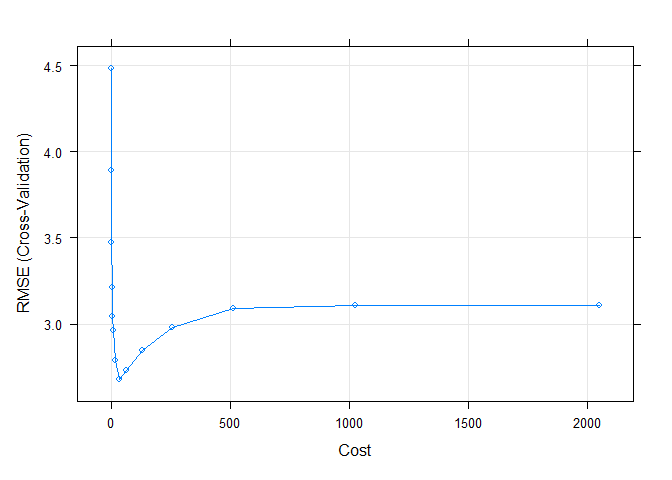
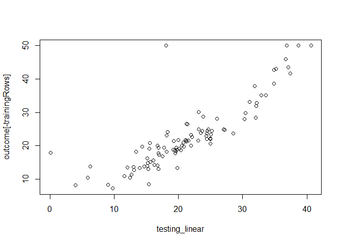
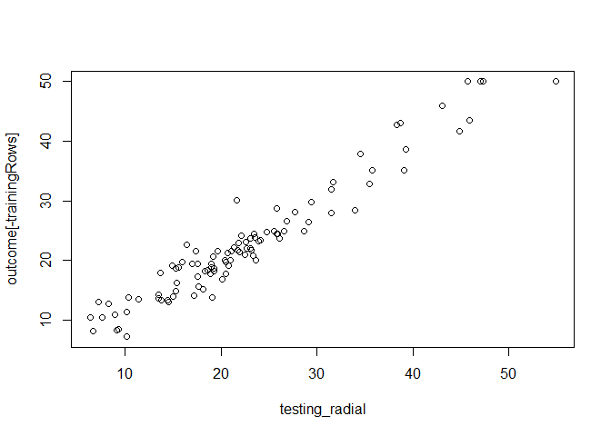

Support Vector Regression
================

## 5. Training and testing data

For support vector regression, we only can use predictors that represent
numeric data, that’s why I will remove the factors.

``` r
training_data <- raw_data[trainingRows, numeric_variable]
testing_data <- raw_data[-trainingRows, numeric_variable]

colnames(training_data)
```

    ##  [1] "tract"   "lon"     "lat"     "crim"    "zn"      "indus"   "nox"    
    ##  [8] "rm"      "age"     "dis"     "rad"     "tax"     "ptratio" "b"      
    ## [15] "lstat"

## 5.1 Building the model

The kernels used will be linear and radial.

``` r
svmRTuned.linear <- train(training_data, outcome[trainingRows],
                          method = "svmLinear",
                          preProc = c("center", "scale"),
                          tuneLength = 14,
                          trControl = trainControl(method = "cv"))
print(svmRTuned.linear)
```

    ## Support Vector Machines with Linear Kernel 
    ## 
    ## 407 samples
    ##  15 predictor
    ## 
    ## Pre-processing: centered (15), scaled (15) 
    ## Resampling: Cross-Validated (10 fold) 
    ## Summary of sample sizes: 366, 367, 366, 366, 366, 365, ... 
    ## Resampling results:
    ## 
    ##   RMSE      Rsquared   MAE    
    ##   4.893153  0.7066965  3.14578
    ## 
    ## Tuning parameter 'C' was held constant at a value of 1

``` r
svmRTuned.radial <- train(training_data, outcome[trainingRows],
                          method = "svmRadial",
                          preProc = c("center", "scale"),
                          tuneLength = 14,
                          trControl = trainControl(method = "cv"))

plot(svmRTuned.radial)
```

<!-- --> \

## 5.3 Comparing performance

``` r
library(Metrics)
testing_linear <- predict(svmRTuned.linear, testing_data)
linear_mae     <- round(mae(actual = outcome[-trainingRows], predicted = testing_linear), 2)
linear_rmse    <- round(rmse(outcome[-trainingRows], testing_linear), 2)
linear_mse     <- round(mean((testing_linear - outcome[-trainingRows])^2), 2)
plot(testing_linear, outcome[-trainingRows])
```

<!-- -->

``` r
testing_radial <- predict(svmRTuned.radial, testing_data)
radial_mae     <- round(mae(actual = outcome[-trainingRows], predicted = testing_radial), 2)
radial_rmse    <- round(rmse(outcome[-trainingRows], testing_radial), 2)
radial_mse     <- round(mean((testing_radial - outcome[-trainingRows])^2),2)
plot(testing_radial, outcome[-trainingRows])
```

<!-- -->

    ## [1] "Linear svm testing:"

    ## [1] "mae: 3.14"

    ## [1] "rmse: 5.25"

    ## [1] "mse: 27.6"

    ## [1] ""

    ## [1] "Radial svm testing:"

    ## [1] "mae: 2.05"

    ## [1] "rmse: 2.63"

    ## [1] "mse: 6.94"

As we can see, radial kernel got a better performance, linear kernel got
a performance similar as linear regression’s, that’s why we will save the
model built based on the radial model.

## 6. Saving the model

``` r
saveRDS(svmRTuned.radial, file = ".\\svr_model.rda")
```
