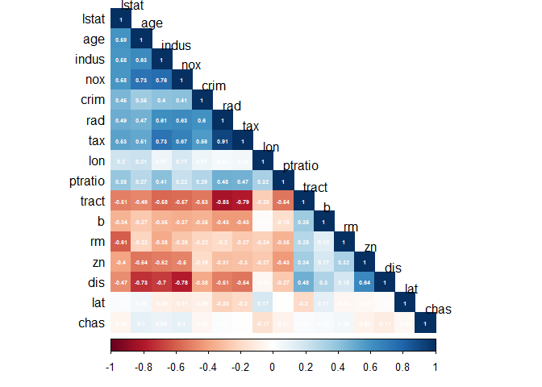
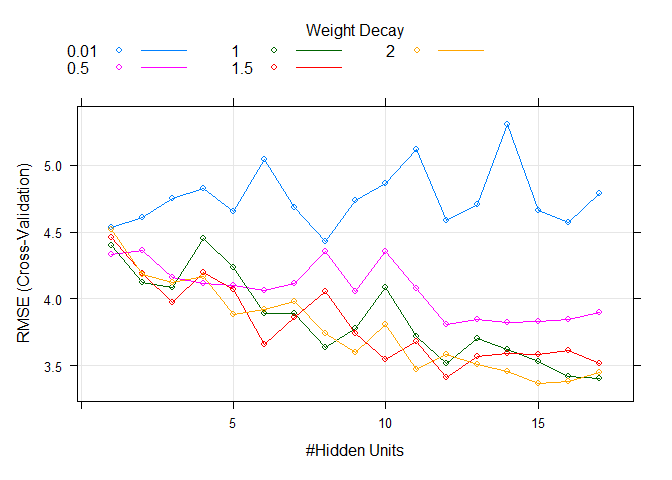
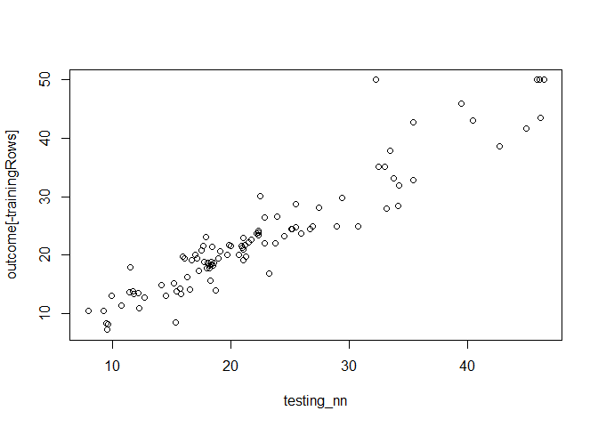

Neural Network
================

## 4. Exploring data

### 4.1 Relationships

#### 4.1.1 Correlations

Multicollinearity affects negatively to the performance of neural
networks.

<!-- -->

## 5. Training and testing data

For the model we’ll remove high correlated predictors, we set a
threshold of 0.75.

``` r
# Selecting
training_data <- raw_data[trainingRows, numeric_variable]
testing_data <- raw_data[-trainingRows, numeric_variable]
# Removing multicollinearity
tooHigh <- findCorrelation(cor(training_data), cutoff = .75)
trainXnnet <- training_data[, -tooHigh]
testXnnet <- testing_data[, -tooHigh]

colnames(trainXnnet)
```

    ##  [1] "lon"     "lat"     "crim"    "zn"      "chas"    "rm"      "age"    
    ##  [8] "dis"     "rad"     "ptratio" "b"       "lstat"

## 5.1 Building the model

We’ll set a maximum of 17 hidden layers.

``` r
nnetGrid <- expand.grid(.size = c(1:17),
                        .decay = c(0.01, 0.5, 1, 1.5, 2))

ctrl <- trainControl(method = "cv", number = 10, returnResamp = "all",savePredictions = "all")

set.seed(100)

nnetTune <- train(trainXnnet, outcome[trainingRows],
                    method = "nnet",
                    tuneGrid = nnetGrid,
                    trControl = ctrl,
                    preProc = c("center", "scale"),
                    linout = TRUE,
                    trace = FALSE,
                    MaxNWts = 17*(ncol(trainXnnet) + 1) + 17 + 1,
                                    maxit = 500)

plot(nnetTune)
```

<!-- --> \## Performance

``` r
library(Metrics)
testing_nn <- predict(nnetTune, testXnnet)
plot(testing_nn, outcome[-trainingRows])
```

<!-- -->

``` r
nn_mae     <- round(mae(actual = outcome[-trainingRows], predicted = testing_nn), 2)
nn_rmse    <- round(rmse(outcome[-trainingRows], testing_nn), 2)
nn_mse     <- round(mean((testing_nn - outcome[-trainingRows])^2),2)
```

    ## [1] "mae: 2.37"

    ## [1] "rmse: 3.37"

    ## [1] "mse: 11.32"

## 6. Saving the model

``` r
saveRDS(nnetTune, file = ".\\nn_model.rda")
```
