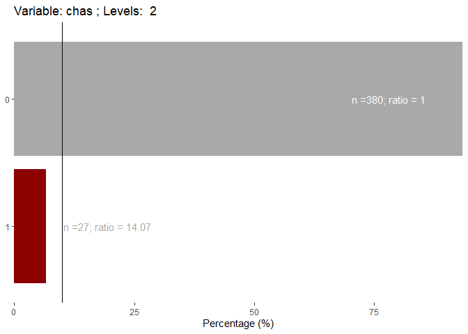
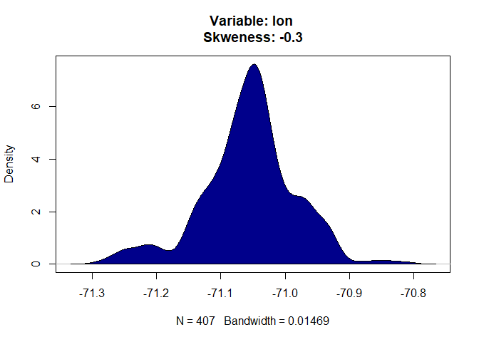
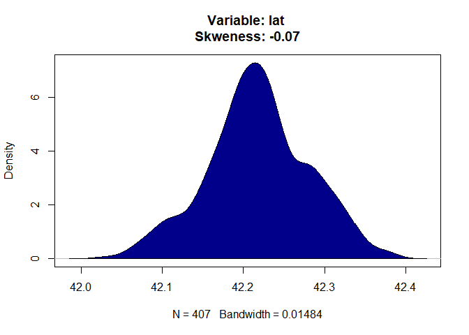
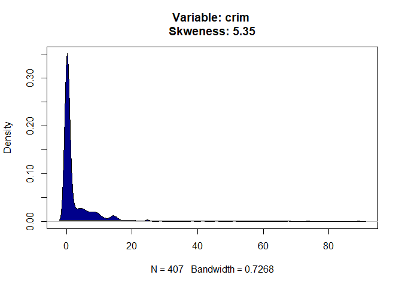
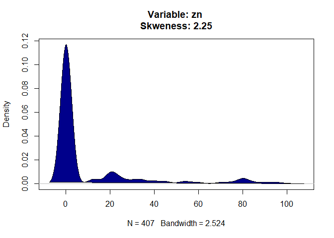
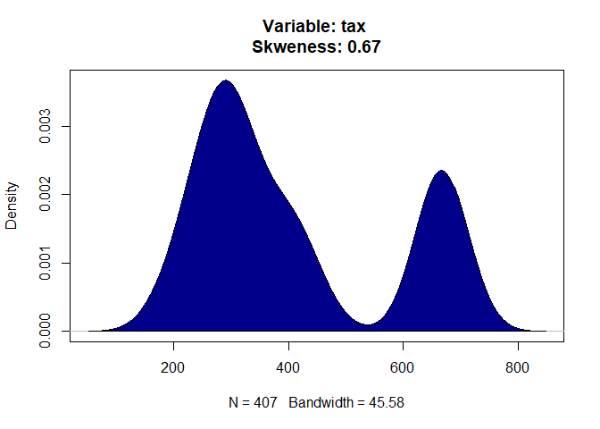
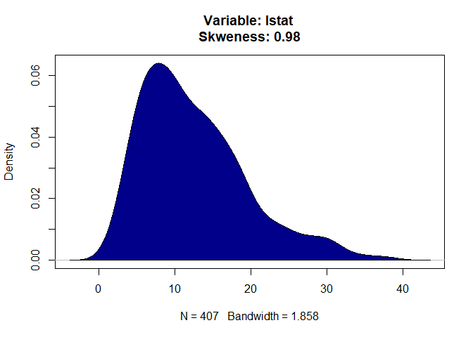

Predictive model for owner-occupied Boston’s homes
================

=========================================================================
**Summary:** This project aims to build a predictive model for
***corrected median value of owner-occupied Boston’s homes in USD
1000’s*** (`cmedv`). Linear regressions, SVD, and neural networks were
used to trained candidates models, the best of each one was compared to
select the final predictive model.

=========================================================================

## 1. Model’s Purpose

To predict ***corrected median value of owner-occupied Boston’s homes in
USD 1000’s*** (`cmedv`). The model might not be generalizable to some
towns due to the lack of data from some of them. Review session 4.1.1.

## 2. Data

The dataset to use is `BostonHousing2` from `mlbench` library. The
outcome is labelled as `cmedv`. There are not missing values.

    ##                 town         tract           lon              lat       
    ##  Cambridge        : 30   Min.   :   1   Min.   :-71.29   Min.   :42.03  
    ##  Boston Savin Hill: 23   1st Qu.:1303   1st Qu.:-71.09   1st Qu.:42.18  
    ##  Lynn             : 22   Median :3394   Median :-71.05   Median :42.22  
    ##  Boston Roxbury   : 19   Mean   :2700   Mean   :-71.06   Mean   :42.22  
    ##  Newton           : 18   3rd Qu.:3740   3rd Qu.:-71.02   3rd Qu.:42.25  
    ##  Somerville       : 15   Max.   :5082   Max.   :-70.81   Max.   :42.38  
    ##  (Other)          :379                                                  
    ##       medv           cmedv            crim                zn        
    ##  Min.   : 5.00   Min.   : 5.00   Min.   : 0.00632   Min.   :  0.00  
    ##  1st Qu.:17.02   1st Qu.:17.02   1st Qu.: 0.08205   1st Qu.:  0.00  
    ##  Median :21.20   Median :21.20   Median : 0.25651   Median :  0.00  
    ##  Mean   :22.53   Mean   :22.53   Mean   : 3.61352   Mean   : 11.36  
    ##  3rd Qu.:25.00   3rd Qu.:25.00   3rd Qu.: 3.67708   3rd Qu.: 12.50  
    ##  Max.   :50.00   Max.   :50.00   Max.   :88.97620   Max.   :100.00  
    ##                                                                     
    ##      indus       chas         nox               rm             age        
    ##  Min.   : 0.46   0:471   Min.   :0.3850   Min.   :3.561   Min.   :  2.90  
    ##  1st Qu.: 5.19   1: 35   1st Qu.:0.4490   1st Qu.:5.886   1st Qu.: 45.02  
    ##  Median : 9.69           Median :0.5380   Median :6.208   Median : 77.50  
    ##  Mean   :11.14           Mean   :0.5547   Mean   :6.285   Mean   : 68.57  
    ##  3rd Qu.:18.10           3rd Qu.:0.6240   3rd Qu.:6.623   3rd Qu.: 94.08  
    ##  Max.   :27.74           Max.   :0.8710   Max.   :8.780   Max.   :100.00  
    ##                                                                           
    ##       dis              rad              tax           ptratio     
    ##  Min.   : 1.130   Min.   : 1.000   Min.   :187.0   Min.   :12.60  
    ##  1st Qu.: 2.100   1st Qu.: 4.000   1st Qu.:279.0   1st Qu.:17.40  
    ##  Median : 3.207   Median : 5.000   Median :330.0   Median :19.05  
    ##  Mean   : 3.795   Mean   : 9.549   Mean   :408.2   Mean   :18.46  
    ##  3rd Qu.: 5.188   3rd Qu.:24.000   3rd Qu.:666.0   3rd Qu.:20.20  
    ##  Max.   :12.127   Max.   :24.000   Max.   :711.0   Max.   :22.00  
    ##                                                                   
    ##        b              lstat      
    ##  Min.   :  0.32   Min.   : 1.73  
    ##  1st Qu.:375.38   1st Qu.: 6.95  
    ##  Median :391.44   Median :11.36  
    ##  Mean   :356.67   Mean   :12.65  
    ##  3rd Qu.:396.23   3rd Qu.:16.95  
    ##  Max.   :396.90   Max.   :37.97  
    ## 

## 3. Splitting data

The resampling method will be ***stratified cross-validation***. Even
though training data will have the same rows as the `exploring_data`, I
decided to name them differently because training data will have less
predictors (selected predictors).

``` r
library(caret)
raw_data     <- BostonHousing2
outcome      <- raw_data$cmedv

set.seed(2156)
trainingRows <- createDataPartition(outcome,
                                    p = .8,
                                    list= FALSE)

# Data to explore
exploring_data <- raw_data[trainingRows, ]
```

## 4. Exploring data

Variables’ names were divided into different vectors depending on their
variable type. `numeric_variable` for numeric data and `factor_variable`
for factors. `medv` was excluded because it could lead to a loss of
performance due to its relationship with `cmedv` (both are almost the
same variables).

``` r
print(numeric_variable)
```

    ##  [1] "tract"   "lon"     "lat"     "cmedv"   "crim"    "zn"      "indus"  
    ##  [8] "nox"     "rm"      "age"     "dis"     "rad"     "tax"     "ptratio"
    ## [15] "b"       "lstat"

``` r
print(factor_variable)
```

    ## [1] "town" "chas"

### 4.1 Distributions

#### 4.1.1 Factors

1.  `town` has 92 levels with few observations in most of them. To
    include it, we would require almost 92 dummy variables or to know
    deeply their patterns to split them into other classification,
    that’s why it will be dropped.

<!-- -->

    ## 
    ##               Cambridge       Boston Savin Hill                    Lynn 
    ##                      23                      19                      18 
    ##                  Newton     Boston South Boston          Boston Roxbury 
    ##                      15                      13                      12 
    ##              Somerville      Boston East Boston               Brookline 
    ##                      12                      10                      10 
    ##       Boston Dorchester                 Peabody               Braintree 
    ##                       9                       9                       8 
    ##                 Medford                  Quincy                 Waltham 
    ##                       8                       8                       8 
    ##               Arlington Boston Allston-Brighton         Boston Downtown 
    ##                       7                       7                       7 
    ##              Framingham                  Malden                   Salem 
    ##                       7                       7                       7 
    ##                 Belmont     Boston Forest Hills                Weymouth 
    ##                       6                       6                       6 
    ##         Boston Back Bay                 Everett               Lexington 
    ##                       5                       5                       5 
    ##                 Norwood                  Revere                  Woburn 
    ##                       5                       5                       5 
    ##                 Beverly      Boston Charlestown        Boston Hyde Park 
    ##                       4                       4                       4 
    ##         Boston Mattapan                 Chelsea                  Dedham 
    ##                       4                       4                       4 
    ##                 Melrose                  Milton                  Natick 
    ##                       4                       4                       4 
    ##                 Needham                  Sargus               Wakefield 
    ##                       4                       4                       4 
    ##              Winchester                Winthrop      Boston Beacon Hill 
    ##                       4                       4                       3 
    ##     Boston West Roxbury              Burlington                 Concord 
    ##                       3                       3                       3 
    ##                Randolph                 Reading                  Sharon 
    ##                       3                       3                       3 
    ##                 Walpole               Watertown              Wilmington 
    ##                       3                       3                       3 
    ##                 Ashland                 Bedford                  Canton 
    ##                       2                       2                       2 
    ##                 Danvers                 Hingham                Holbrook 
    ##                       2                       2                       2 
    ##               Lynnfield              Marblehead           North Reading 
    ##                       2                       2                       2 
    ##                Rockland                Stoneham              Swampscott 
    ##                       2                       2                       2 
    ##                 Wayland               Wellesley                  Weston 
    ##                       2                       2                       2 
    ##        Boston North End                Cohasset                Hamilton 
    ##                       1                       1                       1 
    ##                 Hanover                    Hull                 Lincoln 
    ##                       1                       1                       1 
    ##              Manchester              Marshfield                Medfield 
    ##                       1                       1                       1 
    ##               Middleton                  Millis                  Nahant 
    ##                       1                       1                       1 
    ##                Pembroke                Scituate                Sherborn 
    ##                       1                       1                       1 
    ##                 Sudbury               Topsfield                  Wenham 
    ##                       1                       1                       1 
    ##                Westwood                   Dover                 Duxbury 
    ##                       1                       0                       0 
    ##                 Norfolk                 Norwell 
    ##                       0                       0

2.  `chas` has few observations in level 1, however, it will be kept
    because its ratio with level 0 is lower than 20.
    <!-- -->

#### 4.1.2 Numeric variables

<!-- --><!-- --><!-- --><!-- --><!-- --><!-- --><!-- --><!-- --><!-- --><!-- --><!-- --><!-- --><!-- --><!-- --><!-- --><!-- -->
